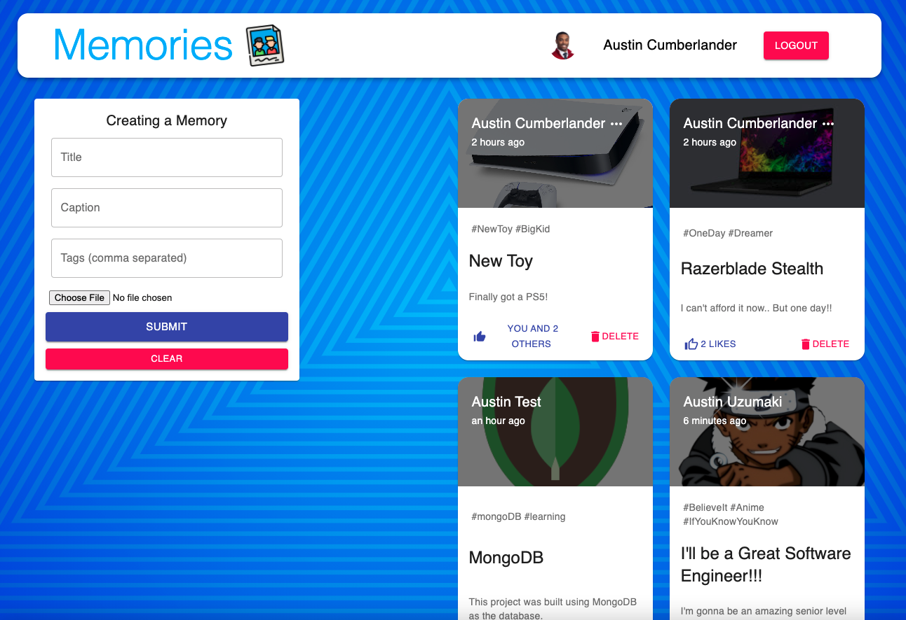

# Memories



Memories is a simple social media application that allows users to create, edit, delete, and like posts. Users of the site must login in order to create their own posts.

This application was a code along project.

## Demo

[See It Live!](https://ac-memories-app.netlify.app/)

## Tech Used

- MERN
  - MongoDB
  - Express
  - React
  - NodeJS
- Mongoose
- Redux
- Axios
- Material UI

## Deployment

- Used Heroku for the server
- Used Netlify for the client

## Running locally

To run this project locally you'll want to run the following command:

```bash
npm i && npm start
```

- You should get console response that shows your local server is running when this command is run in the server directory.

- The app should load up when you run the command in the client directory
